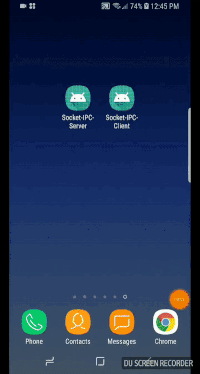
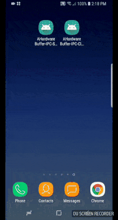

# NDK-Socket-IPC

This this a experiment to see different forms of IPC (inter-process communication) for native apps not exposed to the Android Binder SDK class. The current 3 forms are Unix Domain Sockets, NDK Shared Memory, and NDK AHardwareBuffer. This app has a server app that is one of 4 colors and a client app that changes the color. [My blog post with more details](https://medium.com/@spencerfricke/android-ahardwarebuffer-shared-memory-over-unix-domain-sockets-7b27b1271b36)

<table class="image">
<caption align="bottom">Pure Unix Domain demo (generates full screen color on server end)</caption>
<tr><td></td></tr>
</table>

<table class="image">
<caption align="bottom">AHardwareBuffer demo (server reads data generated from client saved in shared memory buffer)</caption>
<tr><td></td></tr>
</table>

> Disclaimer: The code was a quick prototype, for a friend as a proof of concept. Also have not profiled and not sure if there is better way of doing IPC in native Android app, if so please share since a Google search shows very little on topic

## The 3 Methods

1. [Unix Domain Sockets](Unix_Sockets)
  - Good o'l C style Unix Domain Sockets
	- Same idea if ever sent TCP/UDP Sockets before
  - Works for any version of Android
2. [Shared Memory](Shared_Memory)
  - Using the shared memory API [<android/sharedmem.h>](https://developer.android.com/ndk/reference/group/memory)
  - Android 8.0 (API 26) needed to run
3. [AHardwareBuffer](AHardwareBuffer)
  - Using the native hardware buffer API [<android/hardware_buffer.h>](https://developer.android.com/ndk/reference/group/native-activity)
  - Android 8.0 (API 26) needed to run

## How to run

- Each folder has a Client and Server folder each containing an Android Studio project.
- Open both and install on device.
- Open server app first (currently working on more robust example)
- Open client app and pick color
- Either switch back to server app to see change of color or open LogCat and view the print out
